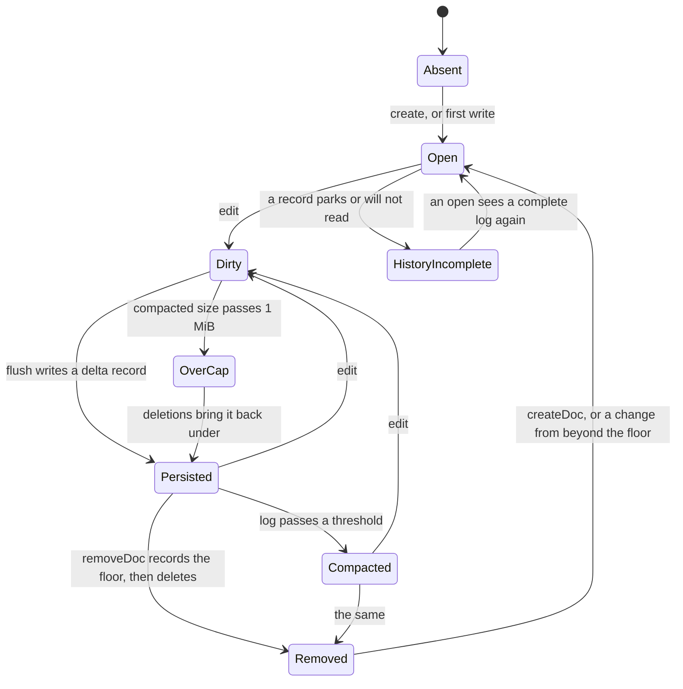
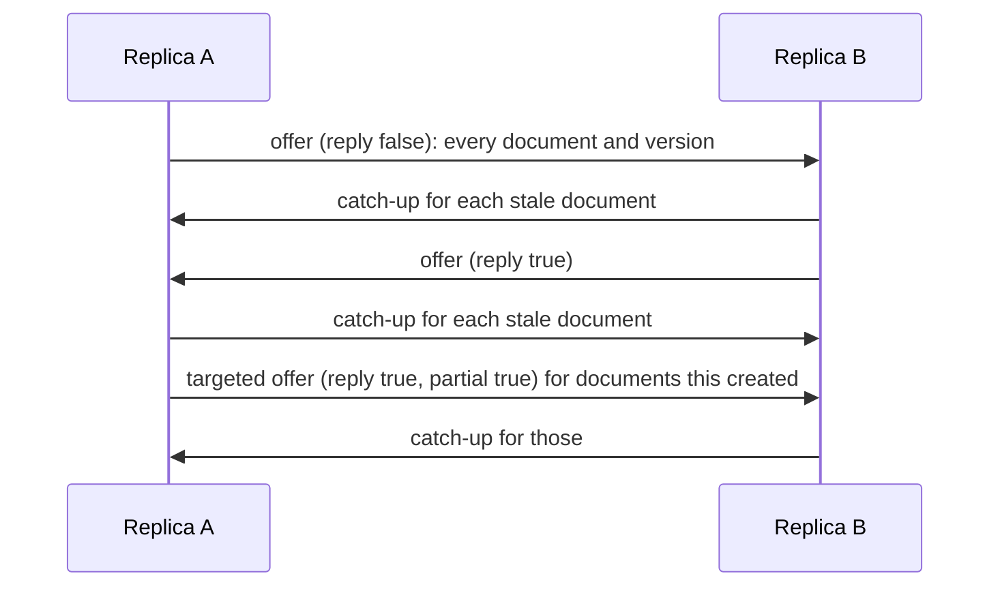
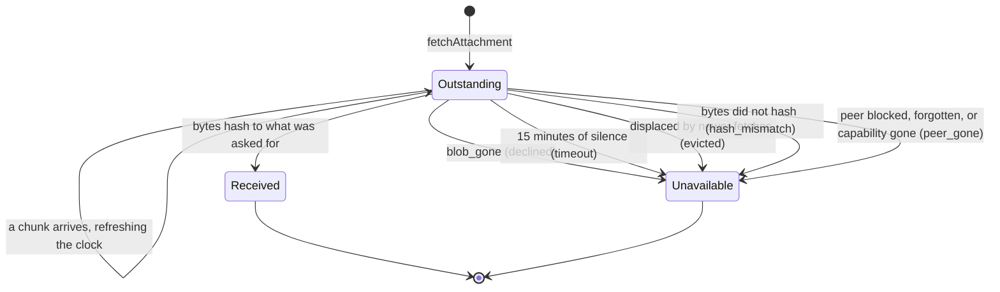

# Document replication

A replicated document from a local edit to a durable record, a space from a
version offer to convergence, and an attachment fetch from the question to one
of six ends.

The wire contract these states implement is
[Document replication](../spec/data-sync.md). The application-facing view is
[Replicated Documents](../data.md).

## Invariants

**D1. The space is derived, never declared.** No frame names its space. A
receiver takes it from the authenticated wire sender, or from the group whose
key opened the ciphertext. A peer that cannot name a space cannot reach a
document shared with somebody else, and there is no authorization table to get
wrong.

**D2. Every leg ends.** An inbound frame produces at most one kind of answer,
and no answer restarts an exchange. The failure this prevents has no symptom on
either device except traffic that never stops.

**D3. Every data-layer outcome is terminal.** A corrupt blob, an unknown
version, a refused import or a switched-off layer is acknowledged and dropped,
never deferred. Deferral means "this same ciphertext will succeed once the
session is ready" and nothing else, so using it for anything else spends the
sender's whole retry budget on a frame that can never be accepted.

**D4. Bytes that came off a network are judged before the engine sees them.**
Everywhere else in this layer the argument for handing bytes to the engine is
that they came out of a sealed record whose AEAD tag vouched for them. MLS says
who sent a blob and nothing about its shape. See
[ADR 0019](../adr/0019-remote-document-imports-are-contained-not-trusted.md).

**D5. Nothing persists about how far a peer got.** The version exchange answers
that question on demand. State that has to be reconciled after a crash is state
that can be wrong.

## A document, locally

**Edits batch; a flush is what makes them durable.** Flushes happen on an
explicit `flush()` or `flushAll()`, and when the protocol instance is dropped,
because the debounce window between an edit and its record is otherwise a
window in which work is lost. `data_changed` fires *after* the record is
durable, so a UI that re-renders on it renders state that survives a restart.

**The cap refuses growth, not the document.** A document is measured
compacted. Past 768 KiB it emits `data_doc_size_warning`, so the cap arrives
while there is still room to act rather than as a failed write. Past 1 MiB the
call raises `DocTooLarge`, the change that breached it is still durable, and
deletions keep applying so the document can be brought back under and resume.

**Compaction folds the log into the document** when the delta log passes four
times the compacted size (with a 64 KiB floor) or after 1024 commits.

**`HistoryIncomplete` switches compaction off for that document.** It is
entered when a delta record parks behind a predecessor that never arrived, or
when a record will not read. Both mean the in-memory document is missing
changes the records still describe, so folding would write a snapshot without
them and then delete the records holding them. A growing log is the cheaper
failure.

**A removal is a version, not a flag.** `removeDoc` records the version the
document stood at, then deletes it. That version is the floor: content at or
below it is what the removal decided about, and anything beyond it is an edit
the removal never saw. The floor is written before the records it removes, so
a crash in between leaves a name every reader already treats as removed and
the next open finishes the job. The reverse order leaves records that vote the
document back into existence.

**A floor outlives its document.** Re-using the name starts a document whose
history is disjoint from the floor, so it is alive, and a stale replica's copy
of the old contents alone is still refused. It is not fenced off: a replica
that kept the old contents past the floor merges them into the new document,
and a stale replica merges the new contents into its old copy. Floors never
expire; they are bounded by the per-space document ceiling, which counts
removed names alongside held ones, and each floor is bounded in size.

**A floor already held decides once.** A floor the record already covers is
answered from memory: no write, no open, no deletion. Floors are re-sent on
every offer, and a name brought back and not yet written to stands at the
empty version, which every floor covers.

**Interest is a refusal here and a request on the wire.** `setInterest`
scopes what this device stores: a document outside it is never created from
an offer and never imported however it arrives. The same patterns are
declared in every version offer, which scopes what the peer sends, but that
half depends on the peer reading them. Interest is not persisted and does not
delete what is already held.

**`deleteDoc` is eviction and records no floor.** It reclaims what the
document occupies here and says nothing about the name, so the next exchange
with a replica that still holds it refills it.

## An exchange, between two replicas

Anti-entropy, not a stream. Each side offers what it holds, the other answers
with what is missing, and the exchange stops.

An answer is scoped to the interest the offer declared, and the scope is the
asker's declared want rather than the names their frame happened to carry:
the second would silently drop a document they have never seen. A
counter-offer carries the complete list regardless, and removals are never
scoped, because a peer that narrowed still holds what it held before.

Removals are applied first, before anything is created or asked for: a name
the peer has removed must not be created from the same frame and then deleted
again. A copy the floor covers is deleted; a copy carrying an edit beyond it
is kept and handed back whole, contents and all, because the edit's history
*is* those contents. That is the one case where a removal loses, and it loses
the same way on every replica.

The last leg is the only chain longer than one hop, and it terminates because
it names only documents the peer has just offered: the peer creates nothing
from it and has nothing to ask for in turn. An offer marked `reply` is never
answered with another offer, which is the rule that keeps D2 true.

Triggers, each of which names its cause in the logs:

| Trigger | Cause | Scope |
|---------|-------|-------|
| A local change becoming durable | pushed immediately | The space it belongs to |
| MLS session confirmed | the confirming event | That peer |
| Peer rediscovered on any transport | `peer_rediscovered` | That peer, and groups shared with them |
| Start-up | `start` | 1:1 spaces only |
| Group joined, or a member added | `group_joined`, `member_added` | That member |

Offers to one peer are suppressed for 30 seconds after the last one. The
window delays only the reconciliation sweep: a local change does not wait for
it, and the next trigger repeats the sweep anyway. Start-up deliberately does
not sweep group spaces, because that would mean an offer per member per group
at every launch to recover something a local commit already pushed.

## The catch-up ladder

Each rung is tried when the one above it cannot carry the gap, and each answer
is terminal.

| Rung | Carries | Bound | What happens when it does not fit |
|------|---------|-------|-----------------------------------|
| `delta` | The changes since the peer's version | 32 KiB per frame | The receiver asks for a snapshot when the changes need history it compacted away |
| `snap` | The compacted document | 32 KiB per frame | Falls to the media path |
| Whole document over the media path | The document as one transfer | 4 MiB, the record ceiling, gated on capability entry 3, 1:1 only | `data_doc_unsyncable` |

A delta that arrives ahead of its predecessor parks, and the receiver answers
with one targeted offer for that document. A snapshot answers nothing in every
outcome, including refusal, which is what lets the rungs below it ask freely.

The end of the ladder is reported rather than logged. `data_doc_unsyncable`
means two replicas that will not converge while both keep accepting edits, and
nothing else about that state looks like a problem.

## An attachment fetch

The fetching side. Every path out of `Outstanding` reports, because a
reference that cannot be opened and never says so is the spinner the whole
frame family exists to kill.

**The timeout is measured from the last sign of life, not from the question.**
The record of the request is what admits the bytes at the end, so a request
that expires mid-carriage discards a blob that fully arrived, and the retry it
invites takes just as long and dies at the same point. Arriving chunks refresh
the entry. Expired entries are swept on the protocol's periodic tick, so a
device that never fetches again still reports.

At most 64 fetches are outstanding at once; the 65th evicts the oldest, which
reports `evicted` rather than going quiet. A fetch toward a peer that never
advertised blob carriage is refused synchronously at the call: no event
follows, because nothing left the device.

The holding side answers `data_attachment_requested`, and the SDK cannot
answer for it: blob bytes never entered protocol state, so only the
application has them.

| Bound | Value | What it stops |
|-------|-------|---------------|
| Per-hash window | 30 seconds | A peer re-asking for one blob it has already been answered about |
| Per-peer budget | 32 live windows | A peer asking for a different hash every time, each costing a map entry and an app callback |
| Global windows | 256, oldest evicted | The bound that still holds when a peer's budget resets |

`provideAttachment` verifies that the bytes hash to the requested address
before anything is sent, so a mistake is reported to the application that made
it while it still has the file in hand.

## Quarantine

A blob about to be imported is recorded on disk first. If the process does not
survive applying it, the next run finds that record and refuses the blob
permanently rather than dying again on every retry. At most 32 digests per
space, oldest out first: every entry is a change this device has decided never
to apply, so a long list is a liability rather than a safety net.

## In a group

The frames and the ladder are identical. Three rules are not:

- **Offers and answers are addressed to one member**, because anti-entropy
  between two members is a conversation between two devices. Only a local
  commit goes to the whole roster.
- **An addressed frame still advances every member's ratchet**, so a sender
  bounds how many it encrypts without giving the roster one and promotes the
  next frame to a roster-wide delivery. See
  [the group message lifecycle](group-message-lifecycle.md#addressed-frames-still-advance-everyones-ratchet).
- **A change received from a group is never pushed back into it.** The
  ciphertext already reached every member; re-broadcasting turns one edit into
  N² frames.
