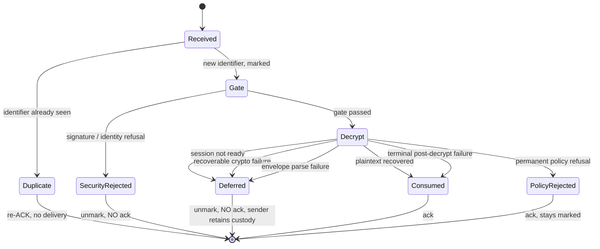
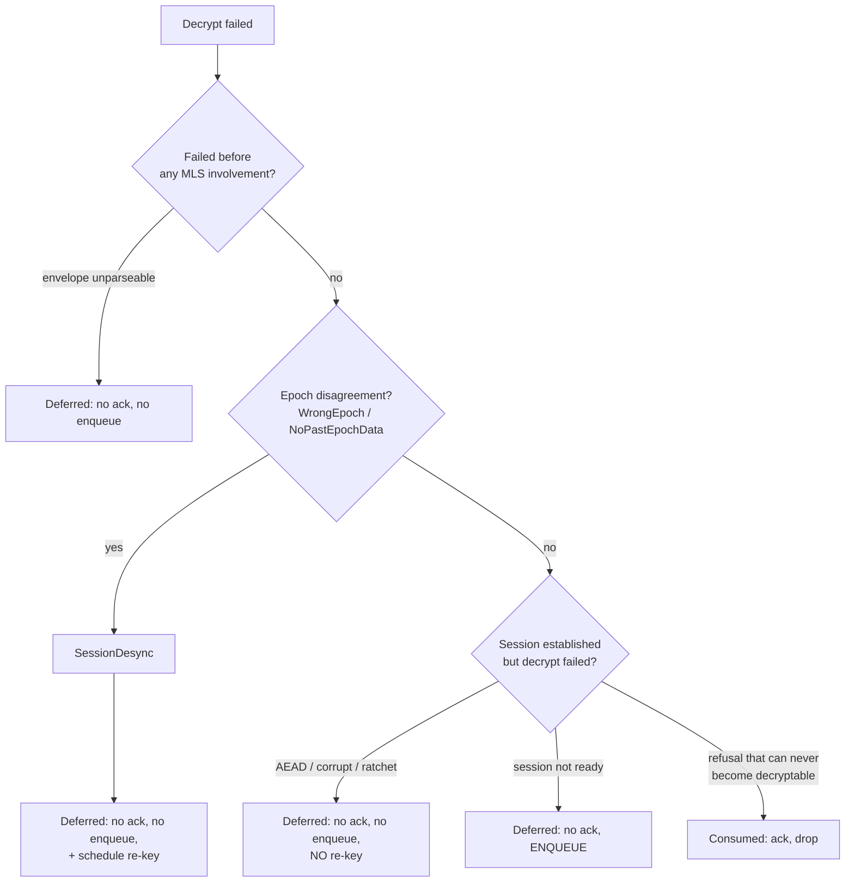

# Delivery and acknowledgements

This is the receive-side state machine. It decides three things for every
inbound frame, together and consistently:

1. Is the frame delivered to the application?
2. Is the sender acknowledged?
3. Does the frame's identifier stay marked in the deduplicator?

Getting any one of those out of step with the other two is how messages are
silently lost. Most of this document exists to explain why particular
combinations are the only correct ones.

## Invariants

**I1. Acknowledge only what is delivered or permanently refused.**
An acknowledgement means "custody transferred". It does not mean "received".

**I2. Withholding an acknowledgement requires unmarking the identifier.**
Otherwise the sender's resend arrives, is seen as a duplicate, and is
re-acknowledged without ever being processed. That is the silent loss.

**I3. Never enqueue a frame that can never become processable.**
A queued copy that can never drain re-reports failures on every drain and
restarts its own time-to-live.

**I4. An acknowledgement is a side channel.** It confirms to whoever sent a
frame that this device is live and processing. Refusals on security grounds
therefore stay silent.

## The five outcomes

Every inbound frame resolves to exactly one:

| Outcome | Delivered | Acknowledged | Identifier stays marked | Queued |
|---------|-----------|--------------|------------------------|--------|
| **Consumed** | yes, or permanently refused | yes | yes | no |
| **Deferred** | not yet | **no** | **no** | sometimes, see below |
| **SecurityRejected** | no | **no** | **no** | no |
| **PolicyRejected** | no | yes | yes | no |
| **Duplicate** | no | yes | yes | no |

## The deferred-acknowledgement atom

The `Deferred` outcome is not a single change. It is six interdependent pieces
that are correct only together. Implementing a subset produces a system that
looks like it works and loses messages.

### The bug it closes

An encrypted message arriving **before** the receiver's MLS session or group
state exists used to be queued for later decryption **and acknowledged**. The
sender then stopped retransmitting. If the queued copy never drained, the
message was gone, with both sides believing it delivered.

### The six pieces

**1. A distinct outcome.** Not-ready must be distinguishable from delivered and
from failed. Without a third outcome the receive loop has nothing to branch on.

**2. Idempotent enqueue, keyed by message identifier.** Resends must not stack.
The time-to-live is measured from **first** receipt, so a peer resending every
few seconds cannot hold an entry alive indefinitely.

**3. Drain on any successful decrypt.** Not only on an explicit session
establishment event.

This is what fixes the both-create case. When two peers create a session
simultaneously, the **owner** side never receives a Welcome, so a
Welcome-triggered drain never fires there. A successful decrypt is the general
proof that the session works.

**4. Re-mark the identifier when the drain surfaces the message.** The receive
loop unmarked it. Once the message is genuinely delivered, the deduplicator must
know, or a later resend delivers it twice.

**5. A time-to-live long enough to be useful.** 2 minutes is too short for
session establishment across a mesh. 30 minutes is the value this protocol uses.

**6. Acknowledge on drain, on the transport the frame arrived on.**

The arrival transport is recorded on the queued entry and the deferred
acknowledgement is sent on it when the drain succeeds.

Without piece 6, the drain closes the loss but leaves a long window in which the
message is delivered locally and the sender is still retransmitting.

### The acknowledgement-latency semantics

Piece 6 degrades gracefully, and application teams need to know how:

- If the arrival transport was not recorded, or that transport is gone, the
  acknowledgement falls back to ordinary transport selection.
- If that also fails, the sender's next resend triggers the duplicate re-acknowledge
  path.

So a late or absent acknowledgement during the not-yet-confirmed window is
**not** loss. The receiver may already hold the message.

**A sender that exhausts its retry budget before both the session confirms and
an acknowledgement lands may still mark the message undeliverable though it was
delivered locally.** That is strictly better than the old silent drop, and
application teams MUST NOT read a missing acknowledgement as non-delivery.

## Classifying decrypt failures

Not every decrypt failure is the same, and the classification decides both the
acknowledgement and whether a re-key fires. Getting the boundary wrong in either
direction is a real bug: too narrow and messages are lost; too wide and the
re-key becomes a denial-of-service amplifier.

### The classes

| Class | Acknowledged | Enqueued | Re-key | Why |
|-------|--------------|----------|--------|-----|
| Session not ready | no | **yes** | no | It will become decryptable when the session arrives |
| Session desync (epoch fork) | no | no | **yes** | Ciphertext is sealed to a dead epoch and can never drain |
| Crypto failure (AEAD, corrupt, ratchet generation) | no | no | **no** | The attempt spent the generation; a queued copy could never drain |
| Transport failure | no | no | no | Recoverable by resend |
| Envelope parse failure | no | no | no | Unparseable now is unparseable forever; the resend is the fix |
| Unknown (commit not authorized, identity mismatch) | **yes** | no | no | Can never become decryptable, so retries are pure waste |
| Post-decrypt failure (empty, non-UTF-8, malformed plaintext) | **yes** | no | no | The generation is spent and a re-seal would produce the same malformed plaintext |

### Why the desync split gates the re-key, not the acknowledgement

**The classification split exists to gate the re-key. Both classes withhold the
acknowledgement.**

Drawing the no-acknowledgement boundary at desync alone was the original bug.
Sender-side re-sealing means every resend is re-sealed against the peer's
current session, so ordinary crypto failures were **already** recoverable while
the receiver was still acknowledging them as delivered.

The separation of desync from ordinary decryption failure is still essential,
but for the other reason: re-keying on AEAD or corruption failures would be a
re-key-storm vector.

Note the subtlety in what "corrupt" covers. **Malformed** input never reaches
framing validation and correctly stays out of the desync class. A **well-formed**
frame carrying a forged epoch **does** classify as desync, which is exactly the
unauthenticated trigger documented as residual risk R2 in the
[threat model](../security/threat-model.md#r2-unauthenticated-session-desync-trigger).

### Why the parse-failure class joined late

Envelope parse failures were the last drop-and-acknowledge arm of this family.
They are the same in-transit corruption as a bad ciphertext, a few bytes earlier
in the encoding, and they were being acknowledged as delivered while the
sender's resend would have parsed and delivered.

Both rationales already accepted point the same way: an honest sender's
corrupted frame is recoverable by the resend, and the acknowledgement is what
kills it; and an injector learns less from silence than from an acknowledgement.

### What stays terminal, and why

Everything **after** a successful decrypt: empty plaintext, non-UTF-8 plaintext,
malformed decoded chunk structures.

The generation is spent, and a sender-side re-seal would re-seal the **same**
malformed plaintext. No resend could ever deliver. Withholding the
acknowledgement there would burn the sender's whole retry budget to no purpose.

## The drain has its own rules

A queued frame that hard-fails when the drain retries it is `Deferred`: no
acknowledgement, no re-mark, and **the queued copy is dropped rather than
re-enqueued**.

That last part is not an optimization. The drain **removes** the entry before
processing it, so a re-enqueue misses the idempotency check and re-stamps the
receipt time, restarting the time-to-live of a frame that can never decrypt, on
every drain, re-reporting an advisory failure each time, even after the sender's
re-sealed resend has already delivered the same identifier.

Nothing is lost by dropping it. The withheld acknowledgement already makes the
sender's resend the recovery path. The one case that genuinely wants a queued
copy, session-not-ready, re-enqueues itself before returning `Deferred`.

Neither the desync arm nor the parse-failure arm is reachable from the drain: a
queued frame parsed at receipt, and parsing is deterministic.

## Media mirrors this, with two differences

Media chunks follow the same outcome set, with media-specific names.

**Difference 1: no sender-side re-seal.** Chunks are re-encoded, not replayed.
Media recovers through a descriptor-based resend request instead.

**Difference 2: two shapes of security rejection.** A media security rejection
covers both a plaintext chunk refused by encryption policy **and** an encrypted
chunk that fails its identity binding.

The second shape is the media half of the two classes the text path has always
answered with silence: an envelope naming another pair's session slot, and a
credential authenticating someone other than the wire sender.

Both MUST be intercepted **before** the ordinary session-state classification,
for the same reason the text path intercepts them inline: both otherwise
classify as `Unknown`, whose terminal drop-and-acknowledge disposition must be
preserved for genuine unauthorized-commit refusals.

This interception is deliberately **not** gated on the crypto-recovery
configuration switch. It is about what the receiver reveals, not about recovery,
and the text equivalent is unconditional.

### Media signal semantics

An evicted encrypted media chunk surfaces a decryption-failure event, but that
signal is **advisory**: the transfer stalled and is recoverable on resend. The
terminal media signal is the receive-failure event.

## What application teams must take from this

1. **A missing acknowledgement is not proof of non-delivery.** See the latency
   semantics above.
2. **Decryption-failure events are advisory and fire per failed attempt.** They
   are bounded by the sender's retry budget, not by the number of messages.
3. **The terminal signals are the failure events**, not the absence of a
   success event.

## Configuration

The whole recoverable-failure family is gated by a crypto-recovery switch,
default on. Disabled, the recoverable classes fall back to legacy
drop-and-acknowledge. It exists as an escape hatch, not as a supported operating
mode.
