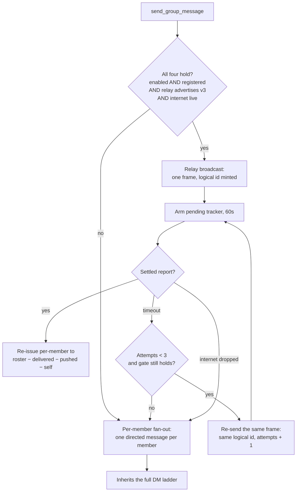
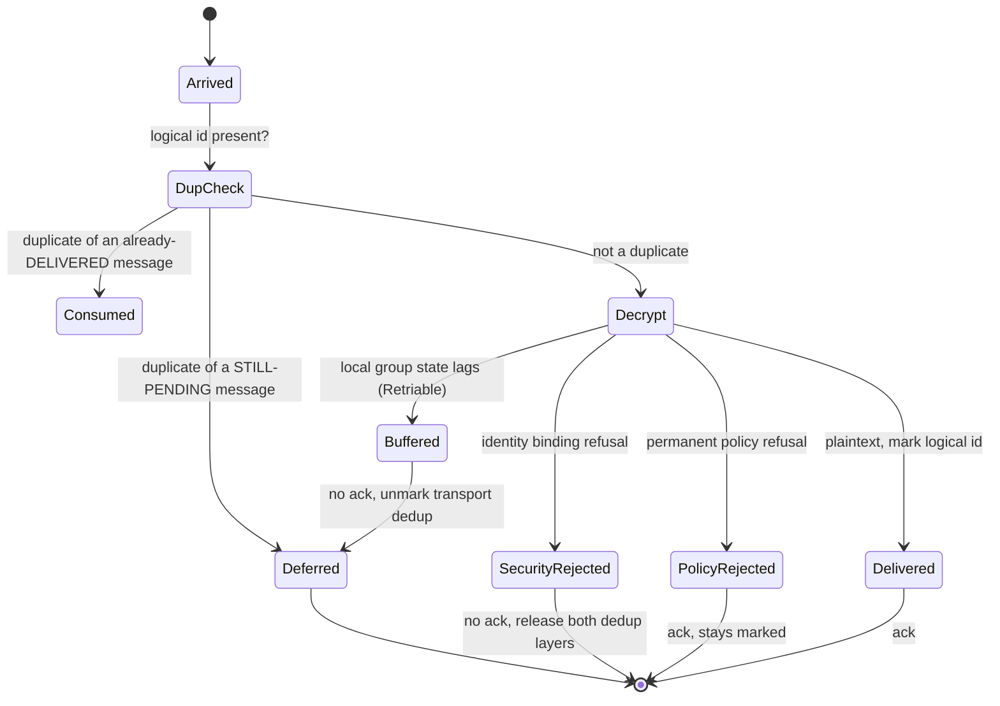
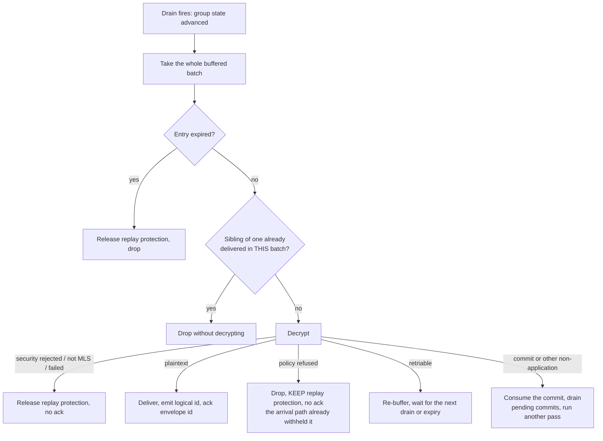
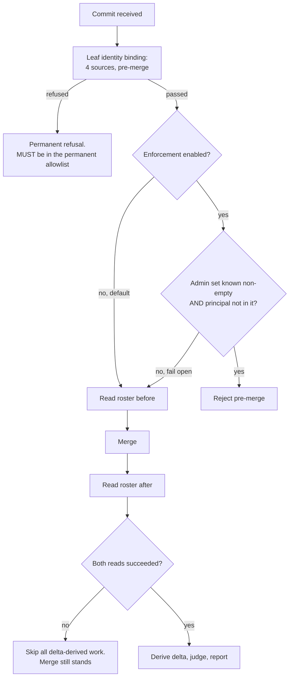

# Group message lifecycle

A group message crosses more paths than a direct message, and the paths have
**different** correctness rules. This document is organized around those
differences, because treating the paths uniformly is how the known bugs in this
area were introduced.

## Invariants

**G1. An MLS decrypt consumes a ratchet generation.** Reaching a plaintext
branch therefore proves first delivery. Bookkeeping that tries to prove the same
thing is at best redundant and at worst suppresses the only decryptable copy.

**G2. Two deduplication layers exist and serve different purposes.** The
group-level layer is the authoritative double-delivery guard and the
replay-amplification defence. The transport layer is ordinary frame
deduplication.

**G3. The mesh path marks a logical identifier only after a successful decrypt.
The relay path marks it at arrival.** Both are correct for their path, and each
carries an obligation the other does not.

**G4. Every relay-path arm that ends with the frame neither delivered, nor
buffered, nor consumed by MLS must unmark before returning.** On the mesh path
the same obligation binds the identity refusal, which releases both layers. Its
other permanent verdicts are acknowledged and stay marked.

## Send

Per-member fan-out inherits the entire direct-message delivery ladder: outbox,
acknowledgement and retry, relay write acknowledgement, offline push carrying
ciphertext, parking, probing, flushing, and the receiver's deferred
acknowledgement handling.

Relay broadcast inherits none of it, which is why it needs the delivery report
to be safe to default on. Details and the capability-token reasoning are in
[Group protocol](../spec/group-protocol.md#relay-broadcast).

## Receive: the three inbound paths

| Path | Frame | Marks logical id | Releases it on refusal |
|------|-------|------------------|------------------------|
| Mesh | `__GRP_MLS_MSG__` | After successful decrypt | Envelope id: **no**, see below |
| Buffered drain | replayed from the buffer | After successful decrypt | Yes |
| Relay | `__GROUP_MSG__` | **At arrival, pre-decrypt** | Yes |

Both live paths buffer the same way, so buffering is not what distinguishes
them: each attempts the decrypt, and each buffers only when the attempt comes
back retriable (a copy that outran its Welcome, most often). The inversion that
does distinguish them is **when the logical identifier is marked**, and its
consequence is **who has to release it**.

The mesh path's non-release on a security refusal is a known defect rather than
a design choice; see
[Group protocol](../spec/group-protocol.md#refusal-dispositions).

### Mesh path

Two group-specific differences from the direct-message deferred atom:

**Difference 1: a buffered message unmarks only the transport deduplication
layer.** The group-level layer stays marked for the whole pending lifetime. It
is the replay-amplification defence and the authoritative double-delivery guard,
so the drain does **not** re-mark the transport layer either.

**Difference 2: a duplicate of a still-pending message returns `Deferred`, not a
re-acknowledgement.** It is checked before decrypt. Only a duplicate of an
already-delivered identifier is `Consumed`.

The unacknowledged sender's recovery path when a buffered entry is evicted or
expires is an explicit release of replay protection, which clears both
deduplication layers.

**The logical identifier is marked only after a successful decrypt**, so a
failed decrypt cannot poison it. Failing to hold that line turns a rejected copy
into an apparent delivery.

**The envelope identifier is released on an identity refusal**, which is the
other half of the same rule. It is marked before the decrypt to bound replay
amplification, so a refusal that leaves it marked leaves it readable as marked
and not pending, which the duplicate branch treats as already delivered: a
verbatim replay is then acknowledged, and that acknowledgement is the liveness
confirmation the refusal withheld. Releasing costs one crypto operation per
replayed copy.

### Relay path

The relay-supplied identifier **is** the logical identifier, and marking it
pre-decrypt is the replay-amplification defence: one MLS operation per
identifier, regardless of how many copies arrive.

That inversion is why G4 exists. Without it:

1. A relay copy is rejected on security grounds, leaving the identifier marked.
2. The per-member re-issue that is the broadcast's own safety net arrives.
3. The duplicate check absorbs it and re-acknowledges.
4. The message is delivered nowhere and the sender is told it was delivered.

The arms that MUST unmark: security rejection, hard failure, and the
plaintext-spoof drop (whose identifier is attacker-chosen wire input).

Permanent policy refusals deliberately do **not** unmark, on either path. A
later copy could only waste work.

`SecurityRejected` and `PolicyRejected` in the diagrams above are group-decrypt
verdicts, one layer below the receive loop. At the boundary the first stays
`SecurityRejected` and the second becomes `Consumed`, which is why it is
acknowledged. See
[the four outcomes](delivery-and-acks.md#the-four-outcomes).

**The obligation extends to the drain, and that half is not optional.** A relay
copy can outrun its Welcome, so it buffers **before** any decrypt and its
misattribution is judged on the drain rather than at arrival. That is an
ordering a hostile relay picks for free. The drain's rejection arm therefore
releases replay protection exactly as its expiry arm does.

Unmarking cannot resurrect a burned generation. The honest recovered outcome is
`Deferred`, custody with the sender, never `Consumed`.

The relay path is also exempt from the deferred acknowledgement, deliberately:
it sends no delivery acknowledgement and its sender is not acknowledgement-gated,
so buffered relay entries carry no arrival transport and the drain's
acknowledgement is a correct no-op.

### The drain

The drain fires when the **group's** state advances: a Welcome joins the group, a
commit merges and moves the epoch, or a commit or proposal arrives on the message
channel. It does not fire on a successful application decrypt, because decrypting
a message changes nothing about whether the rest of the batch can decrypt. That
differs from the 1:1 machine, where any successful decrypt drains the pending
queue, and the difference is worth holding on to: here the unblocking event is
always an epoch change.

The last two arms are what make the drain converge rather than stall. A
retriable entry stays buffered until it decrypts or expires, and a
non-application frame is consumed as a commit and triggers a further pass,
because applying it may be exactly what makes the rest of the batch
decryptable.

**Never add an "already delivered elsewhere?" check to the plaintext branch.**

By G1, reaching that branch proves first delivery, so such a check is
unreachable when true. When false it is fatal: the relay path marks its
identifier at arrival, pre-decrypt, and the pending check is blind to the batch
the drain has already taken, so the check suppresses the only decryptable copy.
That is silent loss.

The sibling set in the diagram is a different thing and is legitimate. It exists
only to drop a sibling copy without burning a doomed decrypt, and, critically,
to stop that sibling's expiry from releasing replay protection for an identifier
that **was** delivered.

The drain emits the **logical** identifier to the application and acknowledges
the **envelope** identifier to the sender.

## Membership changes

Three rules that are easy to get wrong:

1. **A refused commit must be classified permanently refused.** Retriability is
   decided from an allowlist, so a refusal missing from the allowlist is
   buffered, re-decrypted on every drain, and, because a buffered commit that
   expires having been retried reads as an epoch fork, turns one forged commit
   into a group-wide key update round plus a false fork report.
2. **If either roster read fails, skip all delta-derived work.** A silent empty
   default fabricates a full-roster delta and a report naming an innocent
   committer.
3. **The pre-commit roster must be MLS-derived, never the members cache.** Relay
   reconciliation splices entries into that cache that were never in the tree.

The full reasoning for report-by-default and the fail-open enforcement rule is in
[Group protocol](../spec/group-protocol.md#membership-authorization).

## Replication frames take the same three paths

A group space replicates over this exact machinery: a `__DATA_V1__` frame is
encrypted for the group and fanned out per member like any group message. It
therefore arrives by all three inbound paths above, and **all three intercept
it** after the decrypt succeeds and before anything is emitted to the
application. A path that missed the interception would surface the frame to
the user as a chat message whose body is literal `__DATA_V1__` JSON.

On the drain path the interception still owes the deferred ACK: a frame
buffered until group state caught up was never acknowledged, so the sender is
retransmitting until the drain settles it.

What differs from a group message:

| | Group message | Replication frame |
|---|---|---|
| Relay broadcast | Taken when the v3 gate holds | Never: a replication frame has no app-facing id for a delivery report to name |
| Emitted to the app | `GroupMessageReceived` | Nothing; `DataChanged` fires from the store when a change lands |
| Logical id | Used for cross-path dedup | None |
| Gate | Roster | Roster, **and** every member advertising `data_versions` entry 2 |
| Answers | n/a | Addressed to the one member that asked, not broadcast |

A change arriving from the group is never pushed back into it: the group
ciphertext already reached every member, so re-broadcasting would make one
edit cost N² frames.

## Bounds

| Bound | Value |
|-------|-------|
| Pending broadcast trackers | 64, oldest downgraded to per-member on overflow |
| Broadcast attempts under one logical identifier | 3 |
| Broadcast report timeout | 60 s |
| Unauthorized-change report suppression | 300 s per (group, committer, enforced) |
| Unproven-leaf report suppression | 300 s per (group, sender, site) |
| Replication offer suppression | 30 s per (member, group) |

The `enforced` component of the first key is load-bearing. Dropping it lets an
earlier report-only event suppress the refusal alarm for the same committer,
which is the one report that must always reach the application.
