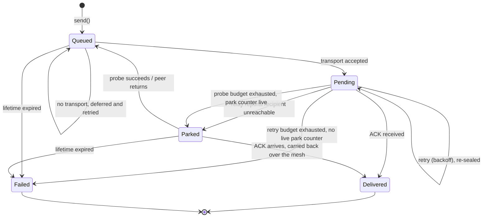

# Outbox and retries

This is the send-side state machine. It governs a message from the moment the
application hands it over until it reaches a terminal state.

## Invariants

**S1. Every message with acknowledgement enabled reaches exactly one terminal
state**: delivered, or failed. There is no third outcome and no indefinite
pending state.

**S2. Expiry is terminal, including across restarts.** A restart may refresh a
relative delivery window, but an absolute cap bounds the total lifetime, or an
application used briefly once per window would re-grant a fresh window forever.

**S3. A resend within a process lifetime is re-sealed, never replayed.** The
ciphertext is regenerated against the recipient's current session; the message
identifier is preserved so deduplication and acknowledgement still match. The
qualifier is load-bearing: re-seal provenance holds plaintext, so it is never
persisted, and an entry restored after a restart replays verbatim. See
[Provenance handling](#provenance-handling).

**S4. Frames that cannot be acknowledged never enter the ladder.** See relay
hint frames below.

## States

**Lifetime expiry cannot settle an entry that has a live pending
acknowledgement.** The sweep skips those, so while a message is genuinely
in flight its bound is the retry ladder, not the 7-day lifetime. Expiry reaches
an entry once it is no longer waiting on an acknowledgement, which is the normal
condition of a `Queued` or `Parked` entry.

The gate is on the acknowledgement, not on the state name, and the two can come
apart: an entry that never asked for an acknowledgement is never skipped, and a
pending acknowledgement can leave the tracker on its own through capacity
eviction or the timed-out-entry prune. So the `Pending --> Failed: lifetime
expired` edge is absent from the diagram because it is not the designed path,
not because it is unreachable in every accounting.

Two edges that are **not** there are worth naming, because both look like they
should be:

- **No transport is not terminal.** A send with nowhere to go persists to the
  outbox, offers the frame to the mesh, schedules a retry, and emits a
  non-terminal deferral event. Terminal failure comes only from retry-budget
  exhaustion or expiry.
- **Parking is entered from `Pending`, not from `Queued`.** The unreachable
  verdict is an asynchronous relay report about a message the transport already
  accepted, which is why there is a pending acknowledgement for the park to
  remove.

## Timing

| Parameter | Default | Notes |
|-----------|---------|-------|
| Acknowledgement timeout | 10 s | Starts at **local enqueue**, not at wire write |
| Maximum retries | 10 | |
| Backoff multiplier | 2.0 | Exponential |
| Maximum backoff delay | 300 s | Caps the exponential |
| Maximum pending acknowledgements | 1000 | |
| Outbox capacity | 500 entries | |
| Outbox lifetime | 7 days | Per entry, carrier-relative |
| Absolute lifetime cap | 4 × lifetime (28 days) | Measured from first send, bounds restart refreshes |

### The timer starts at enqueue

The acknowledgement timer starts when the message is enqueued locally, not when
it reaches the wire. Transport send confirmation advances the Welcome lifecycle
but does **not** re-stamp the acknowledgement timer.

This is the mechanism behind the group fan-out scaling cliff. When a rate
limiter defers frames, a frame late in a large fan-out can time out and be
retransmitted before it was ever written. Deduplication absorbs the duplicates,
so the cost is wasted work rather than loss, but the effect is real past roughly
118 members.

## Retry re-sealing

A retry does not replay stored bytes, as long as the re-seal provenance staged
at send time is still in memory. Before each retransmission the payload is
re-sealed against the recipient's **current** session state, preserving the
message identifier.

### Why

An MLS session that has forked leaves stored ciphertext sealed to a dead epoch.
Replaying it fails forever. Re-sealing means the resend that follows a
receiver-side heal actually delivers.

This is the sender-side half of the desync recovery documented in
[Session lifecycle](session-lifecycle.md). Together with the receiver-side
withheld acknowledgement, it is what makes a session fork recoverable without
message loss, for entries whose provenance is still in memory.

### Provenance handling

Re-seal provenance holds **plaintext**, so it is memory-only and never
persisted. Three rules follow:

1. Staging is strictly transient. Taking a staged re-seal always removes it, and
   removing an outbox entry clears any staged re-seal as well, so a
   staged-but-dropped send never strands plaintext.
2. Re-sealing is gated on the session being confirmed. Re-sealing against an
   unconfirmed session would produce ciphertext the peer cannot open either.
3. **An outbox entry restored after a restart has no provenance, so it replays
   verbatim.** This is the deliberate cost of not writing plaintext to disk, and
   it bounds the no-loss claim above: a fork that begins before a restart is not
   recovered by the resends that follow it, and those messages settle as an
   honest failure rather than delivering late. Persisting the plaintext would
   close the gap and is rejected for that reason.

Media has no equivalent. Chunks are re-encoded rather than replayed, and media
recovers through a descriptor-based resend request.

## Parking

When the relay reports a recipient unreachable, a direct message is **parked**
rather than retried into a void.

A parked message is probed periodically with a backoff that widens from 15
seconds toward 10 minutes. When the peer returns, parked messages re-enter the
queue.

**Parking removes the pending acknowledgement**, which is what makes it
different from a long retry: nothing is counting down against the message any
more.

Removing it is only half the change. The park also **offers the frame to the
mesh**, because the relay has just supplied a fact no local transport status
can, that this specific peer is not on the relay, and a neighbour may still be
able to carry it. An offered copy can therefore arrive and be acknowledged while
no pending acknowledgement exists to match it against, so parked messages are
**settleable without one**: an arriving acknowledgement settles a parked message
`Delivered` directly, emits the delivery event, and flushes the rest of that
peer's parked traffic.

**The offer and the settle arm are one change; neither is correct alone.** An
offer without the settle arm delivers messages the sender never learns about,
which is worse than leaving the message parked. Any future path that hands a
parked message to another carrier inherits this obligation.

The probe itself re-enters the acknowledgement machinery but may never earn a
relay verdict, since a mesh carrier cannot produce one. A probe that exhausts
its budget with a live park counter therefore **re-parks** rather than settling
terminally; settlement is reserved for delivery or outbox expiry.

## Frames that never enter the ladder

Relay hint frames (`__GRP_RELAY_REG__`, `__GRP_RELAY_BCAST__`) are self-addressed
and replaced by the local bridge before transmission. No acknowledgement can
ever return for them.

They MUST be sent with acknowledgement disabled: no outbox entry, no pending
acknowledgement, no retry entry. On the ordinary ladder such a frame is
retransmitted 10 times over roughly 800 seconds, each resend costing another
full relay fan-out under a fresh relay-minted identifier that receiver
deduplication does not catch, ending in a delivery failure for an identifier the
application never saw plus a transport-selector penalty for a transport that did
nothing wrong.

They MUST also be pinned to the internet transport rather than routed by the
selector, for the reason given in
[Control messages](../spec/control-messages.md#relay-hint-frames).

Their retry policy lives at the application layer: bounded, explicit trackers
with their own timeouts and their own downgrade paths.

## Offline push

When the recipient is not reachable and a push channel exists, the ciphertext
travels in the push payload. The message stays in the outbox: a push is a wake
signal plus an opportunistic delivery, not an acknowledgement.

## Restart behaviour

On restore:

1. Lifetime drops an entry, with a terminal failure event, only when it is past
   **both** windows: the carrier-relative lifetime *and* the absolute cap.
   Capacity overflow and unreadable records drop entries too, on their own
   rules.
2. An entry that survives and is past its carrier-relative window gets that
   window refreshed, because a restart means a fresh delivery opportunity.
   Entries still inside their window keep their original stamp.
3. Restoration of per-peer end-to-end capabilities MUST complete **before** the
   queued sends flush, or the flush emits downgraded envelopes to every
   established peer.

Rules 1 and 2 read as one rule and are not. The restore drop requires both
windows to have lapsed, while the in-process sweep drops on **either**. The
difference is deliberate and it is visible: an entry past the absolute cap whose
carrier-relative window was refreshed by a park probe survives restore, and is
then dropped by the first in-process sweep instead. An implementation that
harmonizes the two operators loses the refresh in one direction, or the cap in
the other.

Ordering rule 3 is easy to get wrong because both steps happen during startup
and neither obviously depends on the other. It is a real ordering constraint.
