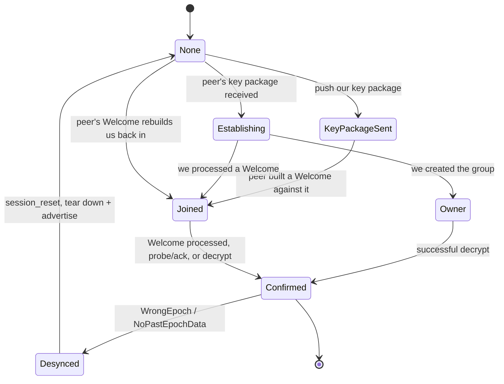

# Session lifecycle (1:1)

A 1:1 session is an MLS group of two, named by the deterministic slot identifier
in [Identity](../spec/identity.md#session-identifiers).

## Invariants

**E1. The slot identifier is symmetric and public.** Both sides compute it
without exchanging it, and so can anyone else.

**E2. An envelope must name the slot shared with its claimed sender.** Checked
before decryption is attempted.

**E3. A session reset destroys session state, never queued plaintext.** The
outbound pending queue holds plaintext and is sealed against the rebuilt session
at flush time.

**E4. One init key per peer.** An MLS init key is single-use.

## Establishment

### Both-create convergence

Both peers can create a session simultaneously. The tiebreaker orders the two
addresses by **hash bytes** (see [Identity](../spec/identity.md#ordering)) and
one side adopts the other's Welcome.

The **owner** side, whose session survives, never receives a Welcome. Any
mechanism that keys off Welcome receipt therefore silently skips the owner. This
is why:

- session confirmation also triggers on **any successful decrypt**, and
- the pending-decryption drain triggers on **any successful decrypt** as well.

"Also" is the operative word. Confirmation is not decrypt-only: the joiner
confirms while processing the Welcome itself, and a plaintext confirmation probe
or its acknowledgement confirms too. Successful decrypt is the trigger added on
top so that the one side no other trigger can reach, the both-create owner, is
still covered. Only that owner, waiting on the adopt path, depends on decrypt
alone.

An encrypted confirmation frame travels inside the envelope on the adopt path
precisely so the owner gets a group-aware decrypt to converge on. It is consumed
on receipt and never surfaced to the application.

## Key package pool

An MLS init key is consumed when a Welcome built against it is processed. Two
peers handed the **same** key package therefore cannot both establish: the
second Welcome is unprocessable.

The pool assigns **one package per peer**. Resolution order for a push:

1. This peer's own live package, so repeat pushes cost no key material.
2. An unclaimed package, claimed here. Claiming is what stops an upgrade
   stranding a pre-existing package.
3. A fresh mint.

The assignment is stored **on the bundle**, not in a side map, so it survives
restarts and cannot disagree with the pool.

Rotation is consumption-driven: a consumed package is reported gone and the next
push mints a successor, which is RFC 9420's guidance to rotate as soon as
possible after use.

### The ceiling

The pool is bounded (64 live packages). **At the ceiling it shares the newest
package rather than refusing to advertise or evicting**, because either
alternative costs session establishment outright, and it reports pool exhaustion
as a suppressed warning.

The ceiling gates **only the mint**, which is the only step that grows the pool.
A claim relabels a package that already exists, so steps 1 and 2 run ahead of the
check and a full pool holding an unclaimed package still hands out its own key.
Gating the claim too would weaken forward secrecy to stay under a bound the claim
never approaches.

Reaching the shared branch therefore proves every live package belongs to another
peer. "Newest" makes it the one most likely to be mid-establishment: if the
over-ceiling peer's Welcome lands first, that peer's advertisement goes
unprocessable until its next push.

### Expiry destroys key material in two stages

Deleting the bundle record alone leaves the private init key in the MLS provider
**forever**, because only a peer's Welcome removes one.

1. Expiry **withdraws** the package from every caller immediately.
2. Only past a grace window (7 days) is the provider key destroyed. The provider
   key is deleted **first**, and the record is kept so a failed deletion can be
   retried.

The grace window exists so a Welcome built just before expiry still opens.

Deletion also purges legacy records whose format predates the bundle: an
unparseable record is read as the serialized key package so its provider
reference is derivable. A record-only delete there is the exact stranding this
rule removes.

## Desync and heal

An **established** session whose two sides disagree on the MLS epoch yields an
epoch-disagreement decrypt failure. This is a dedicated recoverable class, kept
strictly separate from ordinary decryption failure. See
[Delivery and acknowledgements](delivery-and-acks.md#classifying-decrypt-failures).

### Tier 1: honest failure and heal (receiver side)

On a desync the receiver:

1. **Withholds** the delivery acknowledgement and unmarks the identifier.
2. Does **not** enqueue. The ciphertext is sealed to a dead epoch and can never
   drain.
3. Schedules a re-key.

The re-key tears down **our own** stale session and advertises a key package
flagged as a session reset. The peer drops its stale session, rebuilds from our
key package, and Welcomes us back, which we join session-less.

**Deleting the local session is what makes convergence symmetric for both
address orderings.** The returning Welcome is *joined* rather than gated by the
greater-address-adopts tiebreaker.

### The rate-limit floor is never reset early

One re-key per peer per interval (30 seconds), stamped before the send.

A successful decrypt on the healed session does **not** clear the floor. A
genuine re-fork and a replayed old-epoch frame are indistinguishable at this
layer, so clearing on heal would let an attacker interleaving one legitimate
decrypt between replays force roughly one teardown per inbound message.

The floor lapses only by the interval elapsing. Tier 1's withheld
acknowledgement plus sender retries keep delivery honest during the wait.

### Tier 2: true no-loss (sender side)

The sender re-seals each resend against the peer's current session. See
[Outbox and retries](outbox-and-retries.md#retry-re-sealing).

Tier 1 alone makes the fork **detectable and healable**. Tier 2 is what makes it
**lossless**.

### The trigger is unauthenticated and cannot be made otherwise

This is residual risk R2 in the
[threat model](../security/threat-model.md#r2-unauthenticated-session-desync-trigger),
and it is repeated here because it constrains any change to this state machine.

The peer identifier passed to the re-key scheduler is the **wire-claimed**
sender. The encrypted prefix is data-plane and deliberately exempt from the
signature gate; MLS validates the framing header (group identifier, then epoch)
**before** any AEAD, sender-data, or signature check; and a slot identifier is a
public function of two public addresses.

So anyone who can inject a frame reaches this classification, with no key
material, no captured ciphertext, no session, and no replay.

This is inherent to MLS framing, not an implementation defect. A sender-identity
check structurally cannot help: the MLS credential it would compare against
exists only once decryption **succeeds**.

**The mitigation is that acting on the trigger is harmless, not that it is
trusted:**

| Property | Effect |
|----------|--------|
| Slot binding (E2) | One derivable identifier cannot be aimed at arbitrary peers, and the re-key tracking map cannot be grown with attacker-chosen keys |
| Bounded tracking map | Memory is bounded regardless |
| Per-peer rate limit | Churn is bounded |
| Reset preserves the pending queue (E3) | Nothing is destroyed |
| Sender-side re-sealing | Resends deliver after the heal |
| A security warning per re-key | A sustained rate, meaning injection rather than a real fork, is visible |

**Residual:** bounded re-key churn on a pair. Delivery delayed, never lost.

**What would close it:** a signed epoch-corroboration exchange before teardown. A
liveness-only probe does not work, because a healthy peer answers and the
teardown happens anyway.

## Session reset semantics

A session reset:

- deletes local session state,
- **keeps** the outbound pending queue, which holds plaintext and is sealed
  against the rebuilt session at flush,
- advertises a fresh key package with the reset flag set.

The other use of the reset flag is post-unblock convergence: when one side
unblocks the other, it deletes its session and advertises a reset so both sides
converge on a single fresh group rather than one orphaned session each.
