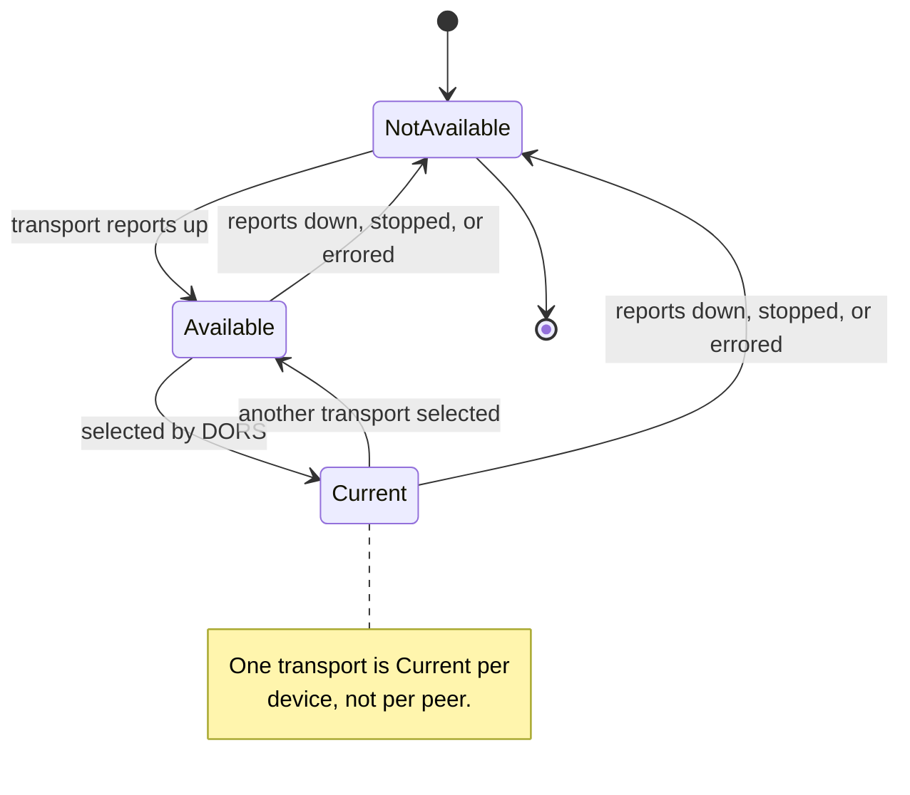
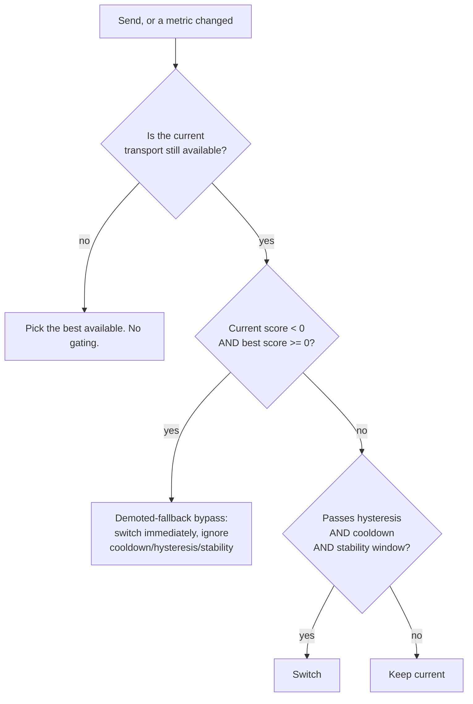

# Transport lifecycle

Transports come and go. This state machine governs which one a message takes,
when the selection changes, and why the change is deliberately reluctant.

The selection engine is called DORS. For the scoring model and tuning
parameters see [DORS deep dive](../dors.md) and
[DORS configuration](../dors-configuration.md); this document covers the state
machine and the invariants a change must not break.

## Invariants

**T1. Flapping is worse than a suboptimal choice.** A transport switch costs a
reconnection and often loses in-flight frames. Hysteresis, cooldown, and a
stability window all exist to make switching reluctant.

**T2. A demoted fallback must never pin out an available real transport.** This
is the one case where reluctance is wrong, and it is an explicit bypass.

**T3. Transport availability is observed, not assumed.** A transport that
accepts a frame and returns success has not delivered it.

**T4. Escalation signals are held, not sampled.** A signal that fires on one bad
sample and clears on the next produces exactly the flapping T1 forbids.

## Transport states

Two vocabularies overlap here and are worth separating before the diagram.

A transport reports its own **status**, one of five values: `Available`,
`Unavailable`, `Connecting`, `Disconnected`, `Error`. Stopping a transport
leaves it `Disconnected`, not `Unavailable`.

**Current** is not one of them. It is a selection-level overlay owned by DORS,
and the diagram below is drawn at that level: it collapses every non-available
status into one node to show when selection changes.

**Current is device-global, not per-peer.** The selector holds a single current
transport for the whole device. Nothing keyed by peer exists, so a change to
make selection peer-specific is a new data structure, not a tweak.

## Selection

### The demoted-fallback bypass

The internet transport is scored with a deliberate demotion so the mesh is
preferred, when `prefer_online` is off and the message does not ask for the
internet. That demotion interacts badly with the ordinary gating, and the
bypass is the fix.

The sequence that makes it necessary:

1. A send finds the mesh peer unreachable and escalates to the internet
   transport.
2. That escalation makes the internet transport current **and re-arms the switch
   cooldown**.
3. The mesh peer comes back.

Without the bypass, the next send rides the relay for the entire cooldown and a
nearby off-relay peer is silently skipped. The bypass fires the instant a real
transport's non-negative score outranks the demoted sentinel.

## Escalation

Escalation is separate from scoring. It answers "this transport is failing, try
a stronger one" rather than "this transport scores lower".

| Trigger | Threshold | Hold |
|---------|-----------|------|
| Consecutive retry failures | 2 | n/a |
| Low success rate | below 0.30 | requires at least 5 samples first |
| Poor signal | RSSI below threshold | must persist 10 s |
| Queue congestion | queue depth over threshold | must persist a configured duration; recovery uses a ratio of the threshold, not the threshold itself |
| TTL near exhaustion | 2 hops remaining | signal held for a configured duration after detection |

Three details in that table are load-bearing and easy to lose in a refactor:

- **The success-rate trigger requires a minimum sample count.** Without it a
  single early failure on a fresh link reads as a 0% success rate and escalates
  immediately.
- **Congestion recovery uses a ratio of the threshold, not the threshold.**
  Recovering at the same value that triggered guarantees oscillation around it.
- **Signals are held after detection.** A TTL signal that cleared on the next
  message would escalate and de-escalate alternately.

## Default gating parameters

| Parameter | Default |
|-----------|---------|
| Switch hysteresis | 15.0 score points |
| Switch cooldown | 20 s |
| Stability window | 8 s |
| Poor-signal duration | 10 s |
| Retry failures before escalation | 2 |
| Minimum success rate before escalation | 0.30 |
| Minimum samples before that check | 5 |
| TTL escalation threshold | 2 hops |
| Prefer online | false |

## Metrics feeding the score

Scoring is multi-factor, over seven factors: signal strength, proximity,
bandwidth, congestion, energy, reliability, and load.

Two observations about the feed that are worth writing down because they were
learned the hard way:

1. **A metrics map with no production writer scores nothing.** A metric that
   only tests populate silently contributes a constant. Any factor added to the
   score needs a live producer, and the absence of one is invisible in unit
   tests.
2. **Configuration read once at construction does not respond to updates.** If
   the selector snapshots its configuration when it is built, a runtime
   configuration update changes a struct nobody reads. A configuration getter
   that round-trips through the same snapshot will confirm the update happened
   and prove nothing.

## Relay role

Relay promotion is derived from **observed forwarding behaviour**, not from a
declared role or a battery feed. That matters because it means the role
resolves on devices that report no battery telemetry at all.

Where a handicap is applied to discourage a role, it must be a **fixed
constant**, not a multiple of a measured span. A multiple of a span shrinks as
the span shrinks, so the handicap disappears exactly when the measurements
converge and it is needed most.

## Per-transport constraints

| Transport class | Chunk size | In-flight window |
|-----------------|-----------|------------------|
| Bluetooth LE | 4 KiB | 2 |
| Default | 32 KiB | 4 |
| Internet | 256 KiB | 8 |

Concurrent media transfers are capped per peer (2), so one large transfer cannot
starve the link.

## What "sent" means at each layer

This is a recurring source of confusion for application teams:

| Layer | "Success" means |
|-------|-----------------|
| Transport `send` returns Ok | The frame was accepted for transmission. Some transports enqueue unconditionally |
| Transport send confirmation | The frame reached the wire |
| Relay write acknowledgement | The relay accepted the frame |
| Delivery acknowledgement | The **recipient** processed it |

Only the last one is delivery. Unconditional-enqueue transports are the reason
relay hint frames must be pinned rather than routed: such a transport swallows a
self-addressed frame and reports success. Wi-Fi Direct and Reticulum behave this
way. Bluetooth LE fails closed, because self is never a connected peer, but that
only helps on a BLE-only device: the transport manager treats a synchronous
refusal as a fallback trigger and hands the frame to one of the others anyway.
